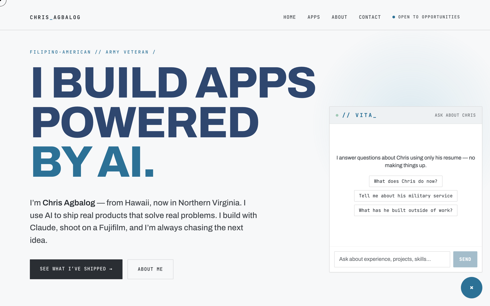
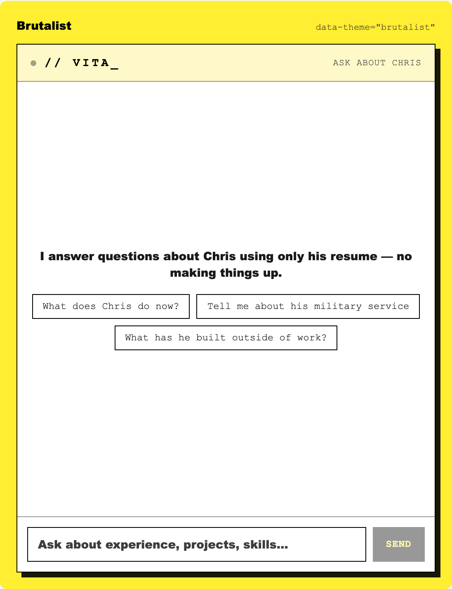
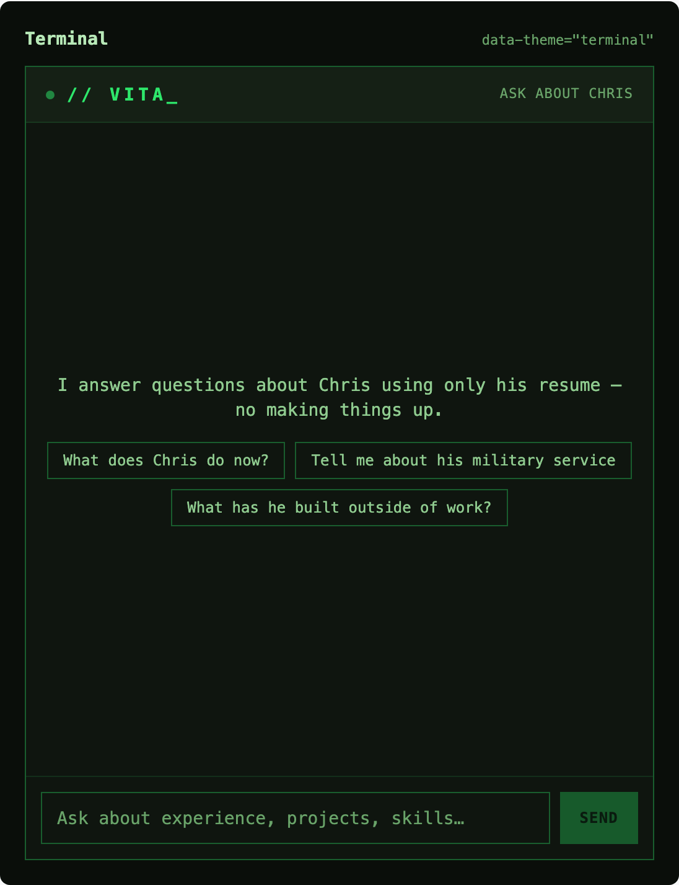
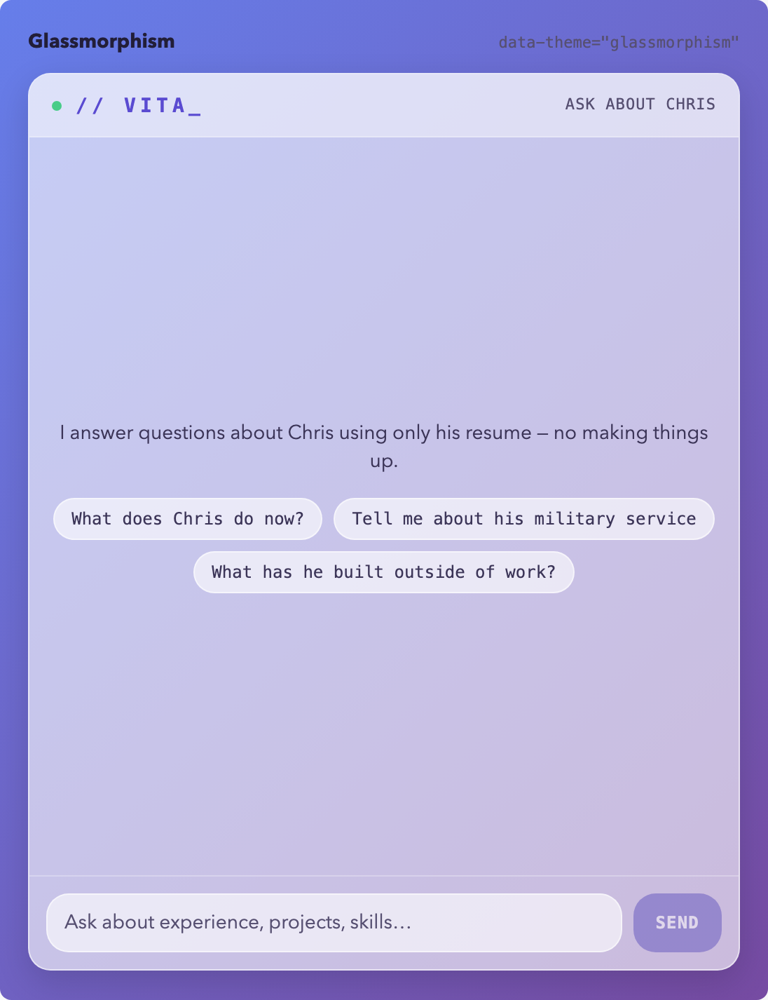
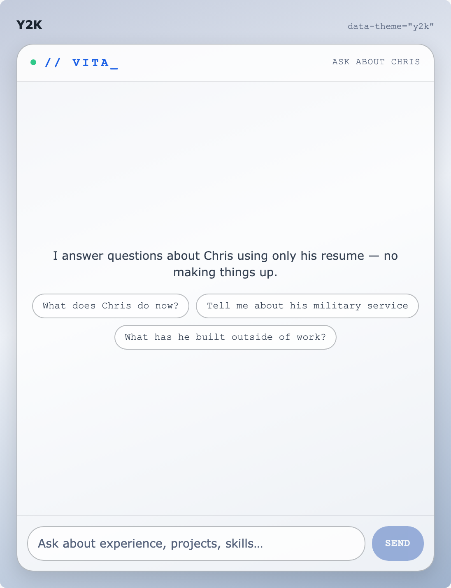

# Vita — a conversational resume that doesn't hallucinate

**Vita** is a chat widget that answers questions about a person using **only** their resume.
If the answer isn't in the data, it says so — charmingly — and pivots to something it *can*
answer. It never makes things up. This repo is the full template — the live demo below is
[Chris Agbalog's](https://chrisagbalog.com) deployment of it.

> **Note on the data:** the committed [`data/resume.json`](data/resume.json) and
> [`evals/cases.json`](evals/cases.json) contain a **fictional sample persona** ("Jordan
> Sample") so the template ships with worked examples instead of anyone's real personal
> data. Real deployments keep their actual resume in gitignored `.private.json` twins,
> which the deploy script and eval harness automatically prefer. Ask the live widget
> questions to get real answers — one at a time, through the guardrails, by design.

**[Live demo](https://vita-widget.vercel.app)** · **[Theme gallery](https://vita-widget.vercel.app/themes)** · **[See it embedded](https://chrisagbalog.com)**



## Why this exists

Most LLM demos wave away hallucination. This project treats it as the central engineering
problem: how do you put a language model in front of strangers, on your own name's website,
and guarantee it won't invent your job history?

The answer here is **defense in depth** — five layers, each catching what the previous one misses:

1. **Strict system prompt** — hard rules: answer only from the resume, refuse everything else,
   resist prompt injection, stay in character.
2. **Full source in context** — the entire resume travels with every request. Nothing is
   retrieved, so nothing can be *mis*-retrieved.
3. **Low temperature (0.2)** — the model is tuned for faithfulness, not creativity.
4. **Honest fallbacks** — refusals are a designed feature with personality
   ("404: Answer not found. But I can tell you about…"), not an error state.
5. **An eval gate on every deploy** — a test suite of questions that must be answered
   correctly and traps that must be refused (honeypots, false premises, a prompt-injection
   probe). **~96% must pass or it doesn't ship** — the live deployment runs a 51-case set
   gated at ≥49. See [`evals/`](evals/).

## Why not RAG?

A resume is ~15KB of JSON. Claude's context window fits it hundreds of times over. A vector
database, embeddings, and a retrieval step would add cost, latency, and a brand-new failure
mode (retrieving the wrong chunk) to solve a problem this project doesn't have. The best
architecture is the simplest one that survives contact with reality:

```
visitor's browser ──iframe──▶ widget (Vercel) ──POST──▶ Supabase Edge Function
                                                              │  full resume + rules
                                                              ▼
                                                        Claude (temp 0.2)
                                                              │  SSE stream
                                                              ▼
                                                    grounded, cited answer
```

More detail in [docs/ARCHITECTURE.md](docs/ARCHITECTURE.md).

## Add it to a site

One line, anywhere in your HTML:

```html
<script src="https://vita-widget.vercel.app/embed.js" defer></script>
```

That mounts a floating launcher bubble (bottom-right) in a sandboxed iframe — host-page CSS
can't touch the widget, and the widget can't touch the host page. Options via data attributes:

```html
<script src="https://vita-widget.vercel.app/embed.js" defer
        data-mode="inline"
        data-target="#ask-me"
        data-theme="terminal"></script>
```

- `data-mode` — `floating` (default) or `inline` (a block in the page flow)
- `data-target` — inline only: CSS selector to mount into (default: where the script tag sits)
- `data-theme` — any preset from `widget/themes/`

## Themes

Eleven presets ship in [`widget/themes/`](widget/themes/) — each one a small JSON file of
design tokens (colors, fonts, radius, shadow). Adding a twelfth is "drop a JSON file in the
folder." Browse them all live at [/themes](https://vita-widget.vercel.app/themes).

| | |
|---|---|
|  |  |
|  |  |

## Fork it — make your own "Ask Me"

Vita is a template. Swap in your resume and it becomes your widget:

1. Fork this repo
2. Write your resume as `data/resume.private.json`, using the fictional
   [`data/resume.json`](data/resume.json) as the worked example (keep the `guardrails`
   section and the `_note`/`note_to_widget` patterns — they're part of the
   anti-hallucination design). The `.private.json` twin is gitignored, so your real
   data never enters git; tooling prefers it automatically when it exists.
   (Prefer full transparency? Just edit `data/resume.json` directly instead.)
3. Personalize the strings: the persona's name appears in the system prompt
   (`supabase/functions/vita-handler/index.ts`), the widget UI copy (`src/`), and
   `public/embed.js` — `grep -ri "chris\|jordan" src supabase public` finds them all
4. Stand up the free-tier backend (Supabase + an Anthropic API key) —
   full walkthrough in [docs/DEPLOYMENT.md](docs/DEPLOYMENT.md)
5. Write your eval cases as `evals/cases.private.json` (sample set:
   [`evals/cases.json`](evals/cases.json)) for *your* facts — aim for 40–60 cases with
   honeypots and guardrail probes — and run the gate before you ship

## Updating the resume

Your resume file (`data/resume.private.json` if you use the private-twin pattern,
otherwise `data/resume.json`) is the single source of truth. After editing it:

```bash
./scripts/deploy-backend.sh   # syncs the resume into the edge function and deploys it
python3 evals/run.py          # re-run the gate — facts changed, so the tests must still pass
```

## Repo layout

| Path | What it is |
|---|---|
| `data/resume.json` | Resume schema with fictional sample data — the only facts Vita may state (real data goes in the gitignored `resume.private.json` twin) |
| `supabase/functions/vita-handler/` | The backend: prompt, guardrails, rate limiting, SSE streaming |
| `src/` | React widget (chat UI, streaming, markdown-lite renderer, embed root) |
| `public/embed.js` | The one-line embed loader (plain JS, no build step) |
| `widget/themes/` | Theme registry — one JSON file per theme |
| `evals/` | The deploy gate: sample test cases + runner (reports are generated locally, never committed) |
| `docs/` | [Architecture](docs/ARCHITECTURE.md) and [deployment](docs/DEPLOYMENT.md) deep-dives |

## Tech stack

React 19 + Vite + Tailwind v4 (widget) · Supabase Edge Functions / Deno (backend) ·
Claude Sonnet 4.6, temperature 0.2 (Anthropic API) · Vercel (hosting + analytics) · Sentry (errors)

Two runtime npm dependencies (`react`, `react-dom`). Everything else is platform.

## Testing

```bash
npm test              # 29 unit tests (streaming protocol, markdown renderer, themes, history)
python3 evals/run.py  # the anti-hallucination gate (hits the live backend)
```

## License

[MIT](LICENSE) © 2026 Chris Agbalog
